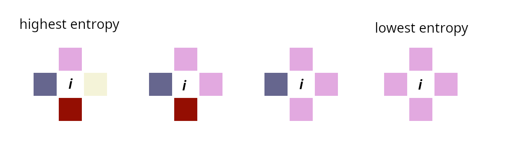
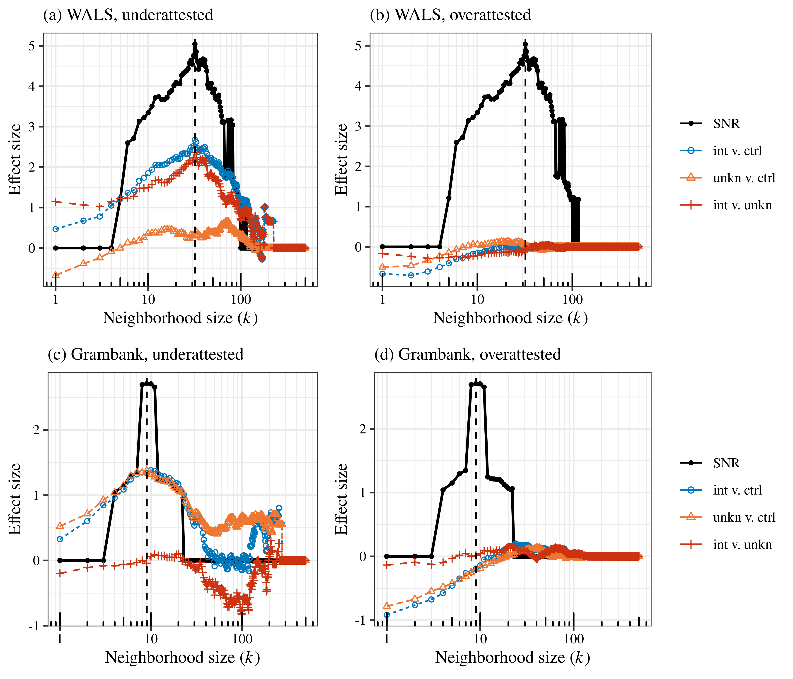
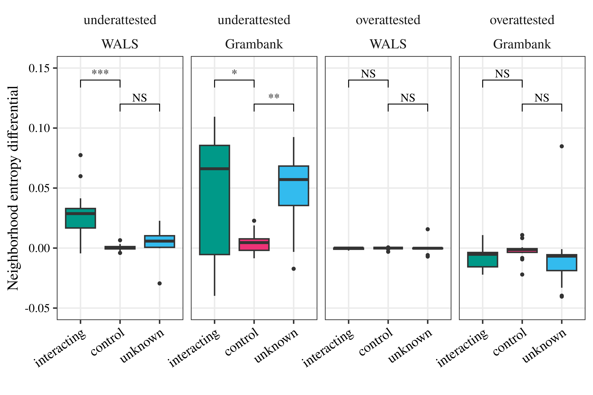
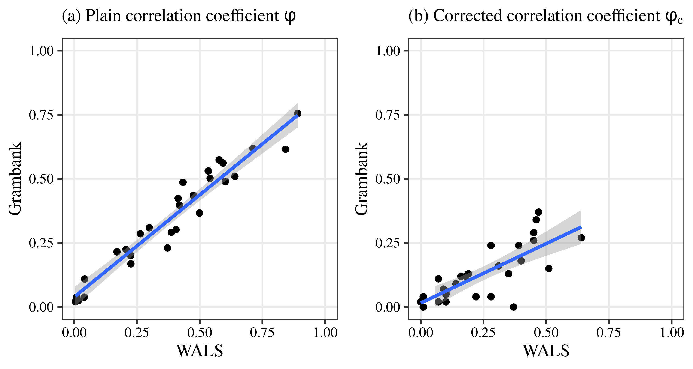

## Background {.callout-container background-image="figures/01-wals-onefeature.png" background-size="70%"}

### Geo-spatial properties of typological features 

::: { .fragment}
::: { .callout-custom }
Individual features show different kinds of spatial patterns.
:::
::: { .callout-spacer}
:::
:::

::: { .fragment}
::: { .callout-custom }
Two randomly-chosen neighbours $L_1$ and $L_2$ are more likely to agree on basic word order than on def. art.
:::
::: { .callout-spacer}
:::
:::

::: { .fragment}
::: { .callout-custom }
Heuristic: *unstable* features scatter, *stable* features cluster [@littlesquares].
:::
::: { .callout-spacer}
:::
:::

::: { .fragment}
::: { .callout-alert }
Are features really *independent*? Do *combinations of features* have meaningful spatial distributions, too?
:::
::: { .callout-spacer}
:::
:::

## Background {.callout-container background-image="figures/02-wals-correlatedpairs.png" background-size="90%"}

### Geo-spatial properties of typological features 

::: { .fragment}
::: { .callout-custom }
A pair of features that is often judged to have a linguistic relationship, and a pair that probably doesn't.
:::
::: { .callout-spacer}
:::
:::

::: { .fragment}
::: { .callout-alert }
How can we differentiate features that are _causally_ related from those that are simply correlated? [@JagWah2021]
:::
::: { .callout-spacer}
:::
:::

## The problem of dispreferred types

Of course, some combinations of typological features are very well known to be **dispreferred** [@Gre1963]&nbsp;[@Hawkins1990]&nbsp;[@WALS]. Classic example:

|              | prepositions | postpositions |
|--------------|-------------:|--------------:|
| VO           | 419          | 37            |
| OV           | 14           | 427           |

. . . 

OV + postposition (Japanese, Turkish) and VO + preposition (Italian, Xhosa) languages are common, but OV + preposition (Persian, Tigrinya) and VO + postposition (Estonian, Guaraní) languages are rare. 

. . .

::: { .callout-alert}
**Q.** If true, why do dispreferred types exist at all? i.e. why do their frequencies simply not vanish to zero with time?
:::
::: { .callout-spacer}
:::

. . . 

::: { .callout-custom}
A1: Because the vertical transition rates of the phylogenetic process just happen to produce this outcome?
:::
::: { .callout-spacer}
:::

. . . 

::: { .callout-custom}
A2: Because dispreferred types receive "support" from neighbouring languages existing stably in preferred types?
:::

. . . 

We will call A1 the **Goldilocks vertical hypothesis** (a kind of null) and A2 the **Horizontal support hypothesis**. 

## How do we decide between the two hypotheses?

The **horizontal support hypothesis** captures one of the default positions on _why_ typological asymmetries should exist in the first place [@HarCam1995 p. 137--141] [@Bickel2007]: i.e. language contact ('borrowing', 'areality') is involved. 

. . .

::: { .callout-alert}
**Obvious idea.** Look at how types are distributed over geographical space.
:::

. . . 

This because

::: {.incremental}
1. Goldilocks vertical predicts: any geospatial patterns are contingent, i.e. we should see no systematic patterns **because of** horizontal support (as it is not thought to exist)
1. Horizontal support predicts: in addition to contingent geospatial patterning, we expect to see systematic differences in which types are neighboured by which other types, because neighbour-ship is required 
:::

. . . 

### What we need

To make all this precise, we need

::: {.incremental}
1. a way to decide whether a given type is dispreferred or not
1. a way to quantify spatial relationships
:::

## Roadmap

1. Correlation ≠ interaction
1. Measuring geospatial diversity
1. Recapitulating predictions
1. Application to WALS [@WALS] and Grambank [@grambank_dataset_zenodo_v1]&nbsp;[@grambank_release]
1. Discussion

## Correlation ≠ interaction

Correlation typically measured using $\varphi = \frac{\textnormal{cov}(f_1,f_2)}{\sqrt{\textnormal{var}(f_1) \textnormal{var}(f_2)}} \in [-1, 1]$

. . . 

For OV/VO and adpositions:

|              | prepositions | postpositions |
|--------------|-------------:|--------------:|
| VO           | 419          | 37            |
| OV           | 14           | 427           |

$\varphi = 0.88$ ($p < 0.001$)

. . . 

However consider:

|              | nominal = locational | nominal ≠ locational |
|--------------|-------------:|--------------:|
| past marking           | 47          | 32            |
| no past marking           | 3           | 45           |

$\varphi = 0.53$ ($p < 0.001$)

Yet in this case no linguistic reasons for believing in an association

## Correlation ≠ interaction

Correlations can clearly arise from a number of causes, some spurious [@Roberts2013]&nbsp;[@Koplenig2016] and we can't pretend to control for all of them. 

We can, however, try to control for the effects of phylogeny[@Bickel2015]&nbsp;[@GuzBec2022] (i.e. the effects of shared ancestry). 

Here, we use the method of **phylogenetic typology** [@JagWah2021] to produce $\varphi_c$, a correlation coefficient **corrected for phylogeny**

. . . 

### In a nutshell:

::: {.incremental}
1. Obtain a sample of languages for a typology
1. Obtain a phylogeny (a set of trees and branch lengths) for this sample using independent (lexical) data
1. Run a (continuous-time) Markov model of features $f_1$, $f_2$ on this set of trees
1. Calculate the type frequencies in the stationary distribution of this Markov process
1. This way, obtain posterior distribution of "phylogenetically corrected" $\varphi$ coefficients.
1. We take the median of this posterior distribution $\varphi_c$.
:::

## The features of interest

- 8 word order features: VS, VO, PN, NG, NA, ND, NNum, NRc [@DunnEtAl2011]&nbsp;[@JagWah2021]

. . . 

- 2 control features:
  - in WALS: NegM (clausal negation signified by negative affixes) and PolQ (polar question particle)
  - in Grambank: AdPo (adnominal possessive construction different for alienable vs. inalienable nouns) and CoA (core adjectives acting like verbs in predicative position)

. . . 

We study all 44 pairs (i.e. typologies) of these 8+2 features

## Credibly interacting typologies

::: {.columns}

::: {.column}

### WALS

| Typology | $N$ | ln(BF) | CPP | $\varphi$ | $\varphi_c$ |
|:---------|----:|-----------------------:|----:|-------:|---------:|
| VO & PN | 863 | 18.01 | 1.5e-8 | 0.89 | 0.64 |
| VS & VO | 1024 | 12.83 | 2.68e-6 | 0.39 | 0.47 |
| PN & NG | 785 | 12.52 | 6.35e-6 | 0.84 | 0.51 |
| VS & NG | 913 | 12.36 | 1.06e-5 | 0.41 | 0.45 |
| NA & NNum | 866 | 11.2 | 2.44e-5 | 0.58 | 0.46 |
| VS & PN | 841 | 10.86 | 4.36e-5 | 0.37 | 0.45 |
| VO & NG | 932 | 10.61 | 6.82e-5 | 0.71 | 0.4 |
| ND & NNum | 814 | 9.14 | 0.000176 | 0.53 | 0.39 |
| NA & NRc | 615 | 7.62 | 0.000664 | -0.5 | 0.35 |
| VO & NRc | 630 | 7.24 | 0.00138 | -0.64 | 0.37 |
| NA & ND | 856 | 5.63 | 0.00494 | 0.59 | 0.28 |
| NNum & NRc | 585 | 5.29 | 0.00997 | -0.17 | 0.31 |
| PN & NRc | 548 | 4.66 | 0.0193 | -0.6 | 0.28 |

:::

::: {.column .fragment}

### Grambank

| Typology | $N$ | ln(BF) | CPP | $\varphi$ | $\varphi_c$ |
|:---------|----:|-----------------------:|----:|-------:|---------:|
| VS & VO | 1788 | 10.83 | 1.99e-5 | 0.29 | 0.37 |
| VS & PN | 1810 | 8.3 | 0.000268 | 0.23 | 0.29 |
| VS & NG | 1617 | 7.07 | 0.00112 | 0.3 | 0.26 |
| NNum & NA | 1396 | 7.06 | 0.00198 | 0.57 | 0.34 |
| PN & VO | 1695 | 6.9 | 0.00299 | 0.75 | 0.27 |
| ND & NA | 1374 | 6.21 | 0.005 | 0.56 | 0.24 |
| ND & NNum | 1565 | 4.67 | 0.0143 | 0.53 | 0.24 |

ln(BF) = nat. log. of Bayes factor

CPP = cumulative posterior probability; typology is interacting if CPP < 0.05

:::
:::

## Overattestation, underattestation

::: {.callout-custom} 
How do we know if a single cell in a tetrachoric table is either overattested or underattested? 
:::

Under a null hypothesis of random shuffling, the number of languages in a given cell follows a hypergeometric distribution [@KivelevEtAl2024]. From this, we get a _p_-value for both overattestation and underattestation. 

If $p(i)$ is the probability of observing exactly $i$ languages in the cell given the hypergeometric distribution, and $n$ the observed number of languages for a given type, then

$p^- = \sum_{i=0}^{i=n} p(i)$ gives the probability of observing $n$ or fewer languages, 

$p^+ = \sum_{i=n}^{i=N} p(i)$ gives the probability of observing $n$ or _more_ languages.

We then call a type **underattested** if $p^- < 0.05$, and **overattested** if $p^+ < 0.05$ likewise. 

## Measuring geospatial diversity: neighbourhood entropy

$\mathbb{T} = \{00, 01, 10, 11\} =$ typology. The focal language has type $= X \in \mathbb{T}$, and a neighbour has type $= Y \in \mathbb{T}$. 

. . . 

(Shannon) entropy of $Y$ as a way to think about _uncertainty_ / _surprisal_. 

$$
H(Y) = -\sum_{t \in \mathbb{T}} P\{Y = t\} \log_2 P\{Y = t\}
$$

. . . 

Neighbourhood entropy w.r.t. $\mathbb{S} \subseteq \mathbb{T}$ (some subtypology of $\mathbb{T}$):

$$
H(Y \mid X \in \mathbb{S}) = -\sum_{t \in \mathbb{T}} P\{Y = t \mid X \in \mathbb{S}\} \log_2 P\{Y = t \mid X \in \mathbb{S}\}
$$

Practically, $P(Y = t \mid X \in \mathbb{S})$ is just the number of languages of type $t$ neighboring languages of types $x \in \mathbb(S)$ divided by the overall n. of neighbours of languages of types $x \in \mathbb(S)$.
. . . 

If distribution of types is truly random, then $P(Y = t \mid X \in \mathbb{S}) = P(Y = t)$, and thus $H(Y | X \in \mathbb{S}) = H(Y)$.

. . . 

This lets us define **Neighbourhood entropy differential $\Xi$**:

$$
\Xi(\mathbb{S}) = H(Y \mid X \in \mathbb{S}) - H(Y)
$$

## So

:::{r-stack}
:::{.fragment}
Neighbourhood entropy differential (NED) $\Xi(\mathbb{S})$ quantifies to what extent types $\in \mathbb{S}$ are surrounded by

- a less diverse neighbourhood ($\Xi(\mathbb{S}) < 0$)
- a more diverse neighbourhood ($\Xi(\mathbb{S}) > 0$)

than would be expected under a random shuffling of the world's languages (i.e. no geospatial signal, $\Xi(\mathbb{S}) = 0$).
:::

{.fragment width=800}
:::

. . . 

In what follows we'll be interested in:

- $\Xi(\mathbb{T}^+)$, NED of overattested types
- $\Xi(\mathbb{T}^-)$, NED of underattested types

in both credibly interacting and non-interacting typologies $\mathbb{T}$

## {background-video="animation_nonconducive.mp4" background-video-loop="true" background-video-muted="true" background-size="contain"}

## {background-video="animation_nonconducive.mp4" background-video-loop="true" background-video-muted="true" background-size="contain" background-opacity=0.5}

::: {.callout-bigspacer}

:::

::: {.callout-alert}
- In this simulated data, there is no difference in mean neighbourhood entropy between 'dark' and 'light' types. 
- The darker types are less _common_, but dark and light types share similar _neighbourhoods_. 
:::

## {background-video="animation_conducive.mp4" background-video-loop="true" background-video-muted="true" background-size="contain"}

## {background-video="animation_conducive.mp4" background-video-loop="true" background-video-muted="true" background-size="contain" background-opacity=0.5}

::: {.callout-bigspacer}

:::

::: {.callout-alert}
- In this simulated data, 'dark' and 'light' types have different types of neighbourhood, with different averaged entropies. 
- Light types cluster; dark types prefer edges. 
:::

## Predictions recapitulated

Let $\mathcal{I} =$ set of interacting typologies

::: {.columns}

::: {.column .fragment width="50%"}
### Goldilocks vertical

Geospatial patterns are contingent and non-systematic w.r.t to interaction, hence expect

$$
\textnormal{E}[\Xi \mathbb{T}^- \mid \mathbb{T} \in \mathcal{I}] = \textnormal{E}[\Xi \mathbb{T}^- \mid \mathbb{T} \notin \mathcal{I}] = 0
$$

i.e. no systematic difference in NDEs of underattested types between interacting and non-interacting typologies
:::

::: {.column .fragment width="50%"}
### Horizontal support

Systematic geospatial effect: dispreferred types need horizontal support, hence their geographical environments ought to be more diverse. Expect:

$$
\textnormal{E}[\Xi \mathbb{T}^- \mid \mathbb{T} \in \mathcal{I}] > \textnormal{E}[\Xi \mathbb{T}^- \mid \mathbb{T} \notin \mathcal{I}] = 0
$$

i.e. underattested types in interacting typologies (= dispreferred types) have systematically higher NEDs than do underattested types in non-interacting typologies
:::

:::

. . . 

(No difference in overattested types predicted by either hypothesis)

## How to define neighbourhoods?

- Calculate distances between every pair of languages, and take $k$ nearest languages for each focal language. 
- The other option is to define neighbourhoods based on _distance_. We think $k$ is arguably a better proxy for the true distances of interest, i.e. adjacency of _edges_ or _overlaps_ between areas corresponding to different languages. 

. . . 

What should $k$ be?

. . . 

We need to balance

1. **local sensitivity**: take enough neighbours to detect signal (too few neighbours $\to$ no signal)
2. **global robustness**: do not take neighbours which are so far away as to not meaningfully contribute to horizontal effects (too many neighbours $\to$ signal clouded by noise)

. . . 

For each $k$ 1–500, regress $\Xi$ on the three-way classification of typologies into interacting, unknown and control. We also inspect a signal-to-noise ratio for each $k$, $\text{SNR}(k) = \sum_i [p_i (k) < 0.05] \cdot \mid d_i (k)\mid$, i.e. the sum of effect sizes over all statistically significant comparisons. 

. . . 

Both very low and very high $k$ are unlikely to give significant results, but we hope for a region of stability in the middle, representing 'reasonable' values of $k$. 

## Results: WALS vs. Grambank

## Results: WALS vs. Grambank at $k^*$

## Why less effect in Grambank?

On WALS, no significant effects for the unknown—control contrast and significant effects for interacting—unknown and interacting—control; on GB, _significant_ effect for unknown—control but not for interacting–unknown. **We have probably not identified all interacting pairs in Grambank / some Grambank _unknown_ are really _interacting_**. 

. . .

$\phi_c$ for Grambank is shifted downward. 

. . . 

. . . 

## Discussion points

- These correlations between word-order features are typological facts that
‘everyone knows’ (latterly even appearing in approaches from generative syntax [@Baker2001] [@Cinque2005]), and explanations are legion, especially as to reasons that the preferred types are preferred. 

. . .

- The proposal that the dispreferred types are supported by contact is also not new, nor even is the proposal that dispreferred types concentrate at the _edges_ of zones of preferred types [@Stilo1987] [@Stilo2005]. But these thoughts have very rarely been considered at scale. 

. . . 

### Our to-do list

::: {.incremental}
- _Refinements_
  + Bigger, better data[@Kalyan2023]? 
  + Other spatial statistics? (?) 
- _Extensions_
  + Asymmetries in direction of correlation?
  + Other features? Multi-valued features? 
:::

## Thank you!

For technical details etc. email us: **deepthi.gopal@lingfil.uu.se** + **mail@hkauhanen.fi**

